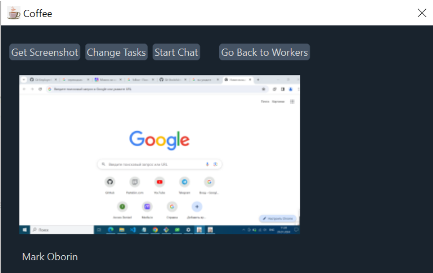

Welcome 👋

## Overview

Приложение работодателя Coffee_boss представляет собой TCP-сервер. При запуске приложения работодатель запускает сервер, к которому могут подключиться работники.

Если сервер еще не запущен, то приложение работника Coffee ждет возможности подключиться и автоматически подключается, когда появляется возможность.

Более подобрно вы можете узнать в README файле репозитория: https://github.com/KozlovVP/Qt-EmployeeMonitoring/blob/main/README.md

