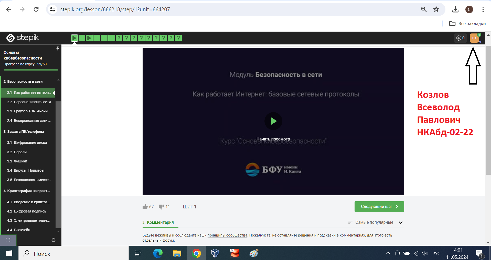
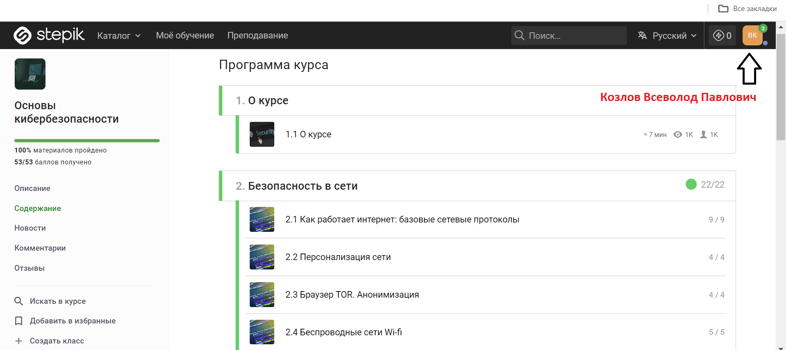
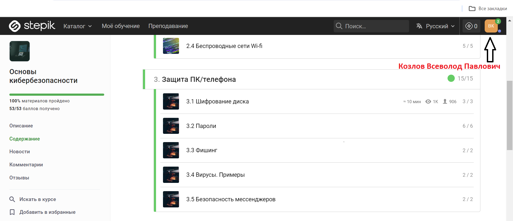
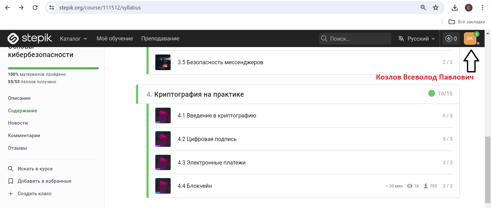
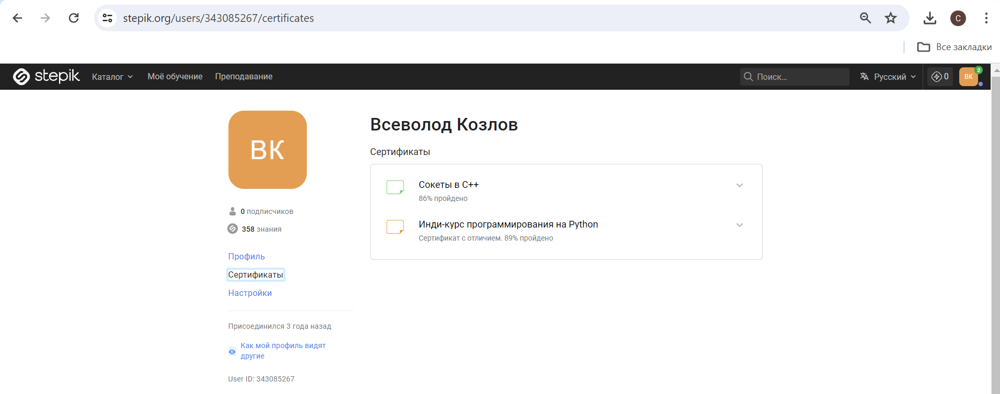

## Козлов Всеволод Павлович (НКАбд-02-22) 

К сожалению, внешние курсы не выдают сертификат. Поэтому прикрепил скриншоты, показывающие все пройденные задания.

# Скриншоты выполненных заданий

Скриншот всех пройденных заданий сразу

Скриншот пройденных заданий первого раздела

Скриншот пройденных заданий второго раздела

Скриншот пройденных заданий третьего раздела

Скриншот, показывающий принадлежность аккаунта Козлову Всеволоду Павловичу (то есть мне)

# Список литературы{.unnumbered}

Внешний курс ["Основы кибербезопасности"](https://stepik.org/course/111512)
